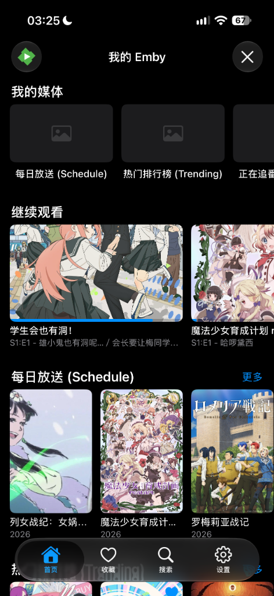
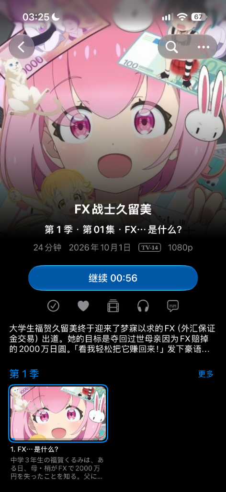

# Akari (Akari Media)

> **注意**：本项目目前为**实验性桥接服务**。它将动漫番剧采集与在线流嗅探能力虚拟化为标准 Emby 媒体服务器协议，无缝兼容主流 Emby 客户端与各大播放器。

Akari 是专为动漫追番打造的流媒体桥接中继服务端。采用 Go 语言构建，内置纯 Go 嵌入式 SQLite 存储引擎与 React 现代管理面板，旨在将自定义规则聚合搜索、智能流媒体嗅探与弹幕能力转换为标准 **Emby Server API**，让任何支持 Emby 协议的客户端（如 Emby 官方客户端、Infuse、VidHub、SenPlayer、Fileball 等）均可直接连接播放，无需预先下载即可将全网番剧变为你的私有影视库。

---

## 现状与实现内容

- **Emby 协议全栈虚拟化**：
  - 虚拟化呈现 **每日放送 (Schedule)**、**热门排行 (Trending)**、**正在追番 (Watching)** 三大动画媒体库。
  - 标准适配 Series / Season / Episode 剧集层级关系与元数据映射，支持精确的未上映剧集门限过滤与单集分类隔离。
  - 收藏（❤️）与「正在追番」强力联动，客户端收藏自动聚合并以整部番剧（Series）优雅呈现。
- **智能聚合搜索与多源容灾嗅探**：
  - 100% 兼容 XPath 与 API (JSONPath) 规则规范，支持官方规则索引库一键并发导入与 CDN/镜像加速。
  - 视频点播时自动执行多关键词扩展、相似度置信度打分、智能选集匹配与故障自动换源重试。
- **流媒体实时反代与自适应时长引擎**：
  - 针对上游流防盗链（Referer / User-Agent）与 CORS 限制，提供 m3u8 与媒体切片实时流式改写与代理中转。
  - 内置四级自适应时长引擎（SQLite 真实播放探测 / M3U8 `#EXTINF` 实时累加 / Bangumi 字段解析 / 剧场版与泡面番启发式推导），告别每集写死 24 分钟。
- **弹弹play ASS 实时弹幕流**：
  - 通过标准 Emby 字幕流接口，将弹弹play 全网弹幕实时转换为高质量 ASS 弹幕字幕，全平台客户端无需插件开箱即看弹幕。
- **局域网 UDP 7359 自动发现**：
  - 内置 Emby 局域网广播发现服务，在同一局域网下的 Emby / Infuse 客户端可直接自动搜索并发现服务器。
- **Bangumi 账户双向同步**：
  - 支持绑定 Bangumi Personal Access Token，自动拉取并在本地同步“在看”、“想看”收藏列表，多端收藏状态强一致持久化。
- **零外部依赖与单二进制打包**：
  - 纯 Go 实现（无 CGO 依赖），内嵌 SQLite（WAL 模式）与生产级 React 19 SPA 管理面板，编译即为单个可执行文件，随时随地即开即用。

---

## 屏幕截图

<table>
  <tr>
    <td align="center"><b>Emby 客户端媒体库与继续观看</b></td>
    <td align="center"><b>剧集详情与 1080p 实时点播</b></td>
  </tr>
  <tr>
    <td></td>
    <td></td>
  </tr>
</table>

---

## 运行方式

### 1. 直接下载并运行预编译二进制

从 Release 下载对应平台的单文件二进制（如 `akari.exe` 或 `akari`）：

```bash
# Windows
./akari.exe

# Linux / macOS
chmod +x akari
./akari
```

启动后控制台将输出服务监听地址（默认 HTTP 端口 `8096`，UDP 发现端口 `7359`）。

---

### 2. 从源码编译与开发

#### 环境要求
- Go 1.22+
- Node.js 18+ 与 npm / pnpm（仅用于前端管理面板打包）

#### 步骤一：构建前端管理面板 (SPA)
```bash
cd web
npm install
npm run build
cd ..
```

#### 步骤二：运行 / 编译 Go 后端
```bash
# 本地直接运行
go run ./cmd/bridge

# 编译为单文件生产二进制
go build -ldflags="-s -w" -o akari.exe ./cmd/bridge
```

---

## 客户端连接指南

启动服务后，打开任意 Emby 客户端或第三方播放器进行连接：

| 配置项 | 填写说明 | 示例 |
| :--- | :--- | :--- |
| **服务器地址** | `http://<你的电脑局域网IP>:8096` | `http://192.168.1.2:8096` |
| **用户名** | 默认管理员账号为 `Admin`（或留空自动探测） | `Admin` |
| **密码** | 默认无密码（可在 Web 后端设置密码） | *(留空)* |

### 项目测试客户端
- **iOS**：Lenna

---

## Web 管理面板

浏览器访问 `http://localhost:8096/web/`（或服务器 IP）即可进入内置管理后台：

- **仪表盘 (Dashboard)**：查看运行状态、连接用户数、播放历史与数据库存储统计。
- **规则管理 (Rules)**：管理启用的采集规则，支持从官方市场 / jsDelivr / GHProxy 一键批量导入规则源，并支持单规则在线测试。
- **用户管理 (Users)**：创建多用户、管理设备令牌、绑定个人的 Bangumi Access Token。
- **播放历史 (History)**：实时查看多端播放记录、断点进度与收藏状态。

---

## 已知问题与局限

1. **依赖第三方采集源站**
   - 本项目不储存任何视频文件，播放依赖第三方规则源站实时抓流。
   - 上游站点改版、域名失效、开启五秒盾或切片 CDN 宕机时，解析规则会失效。需在 Web 管理后台更新规则或换源。

2. **当季新番有时差与上传延迟**
   - 日本深夜首播的新番（通常在 22:00～24:00 CST 播出），第三方资源站通常需要半小时到数小时完成压制与上传。源站未收录前点播会提示片源未上线（404）。

3. **不支持服务端重编码转码（No Server Transcoding）**
   - 为了把内存和 CPU 控制在几十兆，Akari 仅做流代理、m3u8 实时改写与直链中转（DirectPlay），不运行服务端 FFmpeg 实时转码。
   - 播放设备需具备基本硬解能力。推荐使用 Infuse、SenPlayer、VidHub、Emby 官方客户端等原生播放器。

4. **弹幕时间轴可能存在轻微偏移**
   - 弹幕基于弹弹play 标准片源时长匹配。如果某些第三方片源在片头多剪或少剪了垫片广告，弹幕可能会有数秒偏差，可在支持弹幕的播放器中微调时间轴偏移。

5. **极少数冷门条目译名匹配**
   - 依赖 Bangumi 中日文原名与资源站标题模糊匹配。极少数民间汉化组使用了冷僻译名的同人作品或旧 OVA 可能无法自动命中。

---

## 目录结构

```
Emby/
├── cmd/
│   └── bridge/           # 主程序入口 (HTTP / UDP 启动与优雅退出)
├── internal/
│   ├── auth/             # 用户认证、权限策略与 Token 签发
│   ├── bangumi/          # Bangumi API 客户端 (日历、排行榜、搜索、条目、剧集、用户收藏)
│   ├── config/           # 系统配置加载与网络接口自动推导
│   ├── danmaku/          # 弹弹play 客户端与 ASS 弹幕生成引擎
│   ├── discovery/        # UDP 7359 Emby 局域网广播自动发现
│   ├── embyapi/          # Emby RESTful 协议接口实现 (System, Users, Items, Playback, Subtitles)
│   ├── engine/           # 采集规则执行引擎 (XPath / JSONPath 并发搜索与选集)
│   ├── mapper/           # 数据转换器 (Bangumi 元数据 -> Emby BaseItemDto 与自适应时长计算)
│   ├── model/            # Emby 协议与领域数据模型定义
│   ├── proxy/            # 流媒体 M3U8 反代、切片改写与防盗链穿透
│   ├── resolver/         # 视频直链嗅探与网页播放器解析器
│   ├── rules/            # 规则管理器 (存储、启用切换、网络导入与索引并发拉取)
│   └── storage/          # 嵌入式 SQLite 数据库驱动 (WAL 模式持久化存储)
├── web/                  # 内嵌 React 管理面板 (React 19 + Tailwind CSS + Vite)
├── plan/                 # 开发设计与架构文档
├── go.mod
└── README.md
```

---

## 免责声明

1. 本项目基于仅供个人技术研究、协议兼容性探索与学习交流使用。作者与贡献者不对软件的适用性、可靠性或准确性作任何形式的明示或暗示保证。
2. 本项目不提供、不储存、不上载任何音视频资源文件，亦不参与任何第三方网站的内容制作或转码。所有视频流与字幕数据均由用户配置的第三方规则在线实时解析获得。
3. 使用本项目需严格遵守使用者所在地的法律法规，不得用于商业盈利或任何侵犯第三方知识产权的行为。因使用本项目产生的本地缓存应在 24 小时内清除，超出 24 小时的使用需获得相关版权方的授权。
4. 在法律允许的最大范围内，作者和贡献者不对因使用或无法使用本软件所造成的任何直接、间接、偶然或后果性损失承担责任。

---

## 隐私政策

- **零数据收集**：本项目为纯本地运行的私有服务，不收集、不出售、不分析任何用户个人数据。
- **无远程遥测**：系统内部不包含任何埋点上报、分析 SDK 或远程遥测组件。
- **本地持久化**：用户的所有播放记录、设备 Token、Bangumi Token 及收藏状态均保存在本地 SQLite 数据库中，完全由用户自主掌控。

---

## 开源协议

本项目遵循 [GNU General Public License v3.0 (GPL-3.0)](LICENSE) 开源协议。

---

## 致谢

本项目的实现离不开以下项目与开源生态的支持，在此深表感谢：

- [Kazumi](https://github.com/Predidit/Kazumi)：本项目的设计源泉与规则规范标准。特别感谢 [Predidit](https://github.com/Predidit) 及开源社区贡献者。
- [Bangumi 番组计划](https://bangumi.tv/)：提供详尽的动漫条目、放送日历、排行榜与元数据开放接口。
- [弹弹play](https://www.dandanplay.com/)：提供弹幕库开放平台与多源弹幕检索接口。
- [Emby](https://emby.media/) / [Infuse](https://firecore.com/infuse)：卓越的媒体服务器生态与优雅的客户端播放体验。
- [Gin Web Framework](https://github.com/gin-gonic/gin)：高性能 Go HTTP Web 框架。
- [modernc.org/sqlite](https://gitlab.com/cznic/sqlite)：纯 Go 实现的嵌入式 SQLite 引擎，实现无 CGO 极简分发。
- [Lucide Icons](https://lucide.dev/) & [Tailwind CSS](https://tailwindcss.com/)：现代简洁的 UI 视觉与图标组件库。
